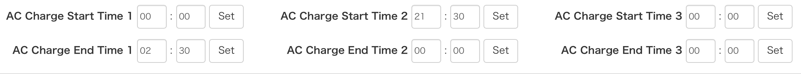

# lxp-bridge

lxp-bridge is a tool to communicate with a LuxPower inverter (commonly used with home-battery and solar setups), written in Rust.

It allows you to monitor and control your inverter locally without any dependence on the manufacturer's own servers in China.

Full documentation is being moved to the [Wiki](https://github.com/celsworth/lxp-bridge/wiki).


## MQTT

> this section is still being moved to the Wiki so remains here for now

As we receive packets from the inverter, we translate the interesting ones (ie not heartbeats) into MQTT messages, as follows.

Note that everything documented here is under `lxp`, but this namespace can be changed in the config file.

`{datalog}` will be replaced with the datalog of the inverter that sent the message; this is because multiple inverters are supported, so you need to know which one a message came from.

### `lxp/{datalog}/hold/1`

1 is actually any number from 1 to 179.

These are unprocessed raw values, sent when the inverter tells us the contents of a register.  This is normally done in response to the inverter being asked for it (which you can do yourself with `lxp/cmd/{datalog}/read_hold/1`, see below).

In some cases, they require further processing to make much sense. For example, registers 2-6 contain the serial number, but it's returned as 5xu16 and needs separating into 10xu8 to match the result you'll see on the inverter's screen. Example 2; register 100 is the lead-acid discharge cut-out voltage, but is in 0.1V units, so divide by 10 to get Volts.

You will see a whole bunch of these if you press "Read" under the Maintain tab in the LXP Web Monitor; this is the website reading all the values from your inverter so it can fill in the form with current values.

### `lxp/{datalog}/inputs/all` (and 1, and 2, and 3)

These are hashes of transient data. The inverter sends these across 3 packets, which are directly mapped into JSON and published in `lxp/{datalog}/inputs/1`, `../2` and `../3`. From lxp-bridge v0.6.0, there is also an `../all` message which combines all three into a single hash of data.

Eventually (not before lxp-bridge v1.0) the individual messages may be removed in favour of the new `all` message. Please prefer use of the `all` message in favour of the 1/2/3 messages in new projects.

These are sent at 5 minute intervals. You can also read them on demand, see `lxp/cmd/{datalog}/read/inputs/1` below.

Also see [inputs.md](doc/inputs.md) for details of the JSON data hashes.


### `lxp/{datalog}/params/0`

These are parameters stored on the datalog (the WiFi dongle), not the main inverter itself. The only parameter I'm aware of is 0 which appears to be the number of seconds between `inputs` broadcasts.

This area is a bit unknown - TODO for myself: try changing params/0 and see if the broadcast interval changes accordingly.


### Commands

When you want lxp-bridge to do something, you send a message under `lxp/cmd/...`. There's two types of response depending what you're doing.

There's a result topic which is `OK` or `FAIL`; for example sending `lxp/cmd/{datalog}/set/ac_charge` will return `lxp/result/{datalog}/ac_charge`.

If you're reading a register then you get the result and additionally the value(s) will be sent in the same topic as above, so for example sending `lxp/cmd/{datalog}/read/inputs/1` will get you a `lxp/result/{datalog}/read/inputs/1` *and* a `lxp/{datalog}/inputs/1` with all the usual data.

*boolean* values recognised as `true` in payloads are `1`, `t`, `true`, `on`, `y`, and `yes`. They're all equivalent. Anything else will be interpreted as `false`.

*percent* values should be an integer between 0 and 100.


The following MQTT topics are recognised:

#### topic = `lxp/cmd/{datalog}/read/inputs/1`, payload = empty

This prompts the inverter to immediately publish a set of input registers. These get published every few minutes anyway but with this you can read them on-demand.

`1` can be 1 - 3. It is not yet possible to read all the registers at once, as seen in `lxp/{datalog}/inputs/all`.

See [inputs.md](doc/inputs.md) for details of the JSON data hashes.


#### topic = `lxp/cmd/{datalog}/read/hold/1`, payload = optional int

This is a pretty low-level command which you may not normally need.

Publishing to this will read the value of inverter holding register 1. The payload is optionally the number of registers to read, with a default of 1 if empty.

The unprocessed reply will appear in `lxp/{datalog}/hold/1`. Depending on which register you're reading, this may need further post-processing to make sense.

If you read multiple registers they will appear in their own replies, `lxp/{datalog}/hold/12`, `lxp/{datalog}/hold/13` etc.


#### topic = `lxp/cmd/{datalog}/set/hold/1`, payload = int

This is a pretty low-level command which you may not normally need.

Publishing to this will set the given register to the payload, which should be a 16-bit integer.

The unprocessed reply will appear in `lxp/{datalog}/hold/1`. Depending on which register you're reading, this may need further post-processing to make sense.

TODO: doc known registers

#### topic = `lxp/cmd/{datalog}/read/param/0`, payload = empty

This is a pretty low-level command which you may not normally need.

Publishing an empty message to this will read the value of datalog parameter 0.

The unprocessed reply will appear in `lxp/{datalog}/param/0`. Depending on which parameter you're reading, this may need further post-processing to make sense.

TODO: separate doc with known parameters? For now only 0 is known to work, which is the interval between inputs being published, in seconds.


#### topic = `lxp/cmd/{datalog}/set/ac_charge`, payload = boolean

Send a boolean to this to enable or disable AC Charging (from the grid). Note that if you have AC Charge schedules set, this may not immediately actually start charging. This can be seen in registers 68 - 73, as per [doc/LXP_REGISTERS.txt](doc/LXP_REGISTERS.txt) - AC_CHARGE_START_HOUR, AC_CHARGE_START_MINUTE, AC_CHARGE_END_HOUR, and AC_CHARGE_END_MINUTE (and \_1 and \_2).

You can check this like so:

```
$ mosquitto_pub -t lxp/cmd/all/read/hold/68 -m 6

<in another terminal...>
$ mosquitto_sub -t lxp/# -v
lxp/cmd/all/read/hold/68 6
lxp/BA00000000/hold/68 0
lxp/BA00000000/hold/69 7682
lxp/BA00000000/hold/70 7701
lxp/BA00000000/hold/71 0
lxp/BA00000000/hold/72 0
lxp/BA00000000/hold/73 0
lxp/result/BA00000000/read/hold/68 OK
```

This example corresponds to these settings (charge from 21:30 to 02:30, I think you need to split them in two to cross midnight):



The integers in 69/70 can be decoded like so:

```
7682 as base2 is 1111000000010
Split that into two bytes, to get 11110 and 00000010
11110 as base10 is 30.
00000010 as base10 is 2.
So this is 2:30

7701 => 1111000010101 => 11110 and 00010101 => 30 and 21 => 21:30
```

#### topic = `lxp/cmd/{datalog}/set/forced_discharge`, payload = boolean

Send a boolean to this to enable or disable immediate forced discharging.


#### topic = `lxp/cmd/{datalog}/set/charge_rate_pct`, payload = percent

Send an integer in the range 0-100 (%) to this to set the global system charge rate. 100% is full power (3.6kW or so generally).


#### topic = `lxp/cmd/{datalog}/set/discharge_rate_pct`, payload = percent

Send an integer in the range 0-100 (%) to this to set the global system discharge rate. 100% is full power (3.6kW or so generally).


#### topic = `lxp/cmd/{datalog}/set/ac_charge_rate_pct`, payload = percent

Send an integer in the range 0-100 (%) to this to set the charge rate when AC charging (from the grid). 100% is full power (3.6kW or so generally).


#### topic = `lxp/cmd/{datalog}/set/ac_charge_soc_limit_pct`, payload = percent

Send an integer in the range 0-100 (%) to this to set the battery SOC at which AC charging will stop.


#### topic = `lxp/cmd/{datalog}/set/discharge_cutoff_soc_limit_pct`, payload = percent

Send an integer in the range 0-100 (%) to this to set the battery SOC at which discharging will stop.


