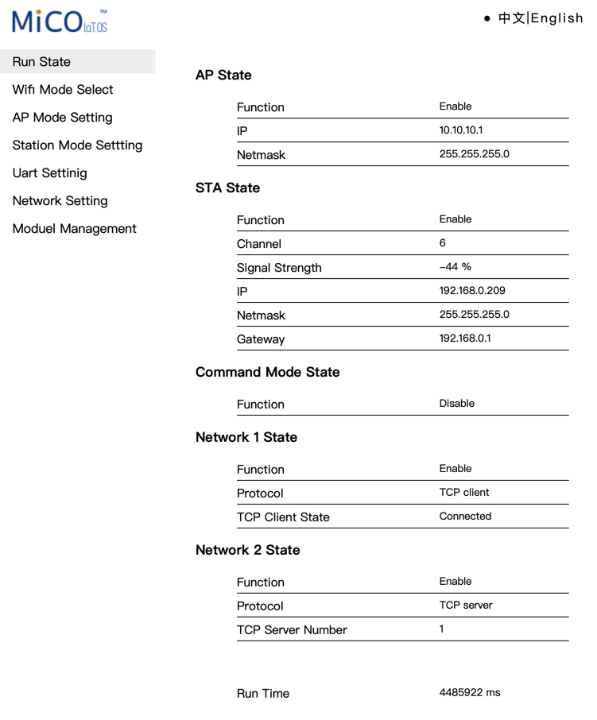
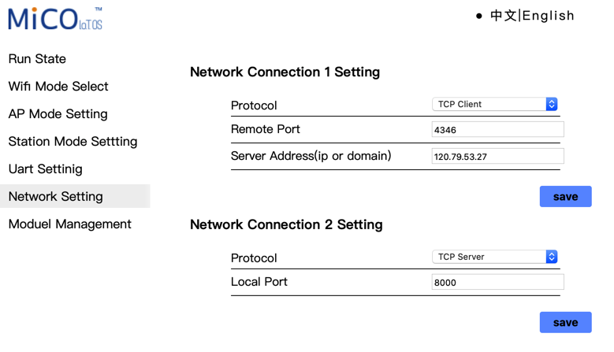
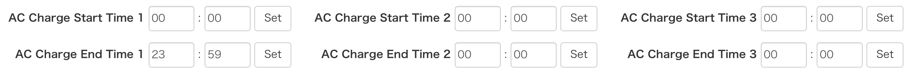

# Inverter Setup

By default, the datalogger plugged into the Lux sends statistics about your inverter to LuxPower in China. This is how their web portal and phone app knows all about you.

We need to configure it to open another port that we can talk to. Open a web browser to your datalogger IP (might have to check your DHCP server to find it) and login with username/password admin/admin. Click English in the top right :)

You should see:

Tap on Network Setting in the menu. You should see two forms, the top one is populated with LuxPower's IP in China - the second one we can use. Configure it to look like the below and save:

After the datalogger reboots (this takes only a couple of seconds and does not affect the main inverter operation, it will continue as normal), port 8000 on your inverter IP is accessible to our Ruby script. You should be sure that this port is only accessible via your LAN, and not exposed to the Internet, or anyone can control your inverter.

## Enabling AC Charge

You may need to tweak a setting to enable AC Charging. This is easiest done on LuxPower's web portal, and the phone apps will let you do it too.

Check that `AC Charge Start Time 1` and `AC Charge End Time 1` are `00:00` and `23:59` respectively, as seen in this screenshot:

This means that AC Charging can be used between 00:00 and 23:59 (ie, any time of day).

Time 2 and Time 3 can be left as they are, unless you specifically want more specific time ranges setting.
